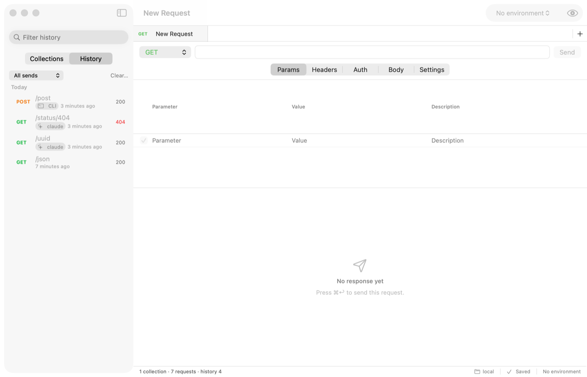
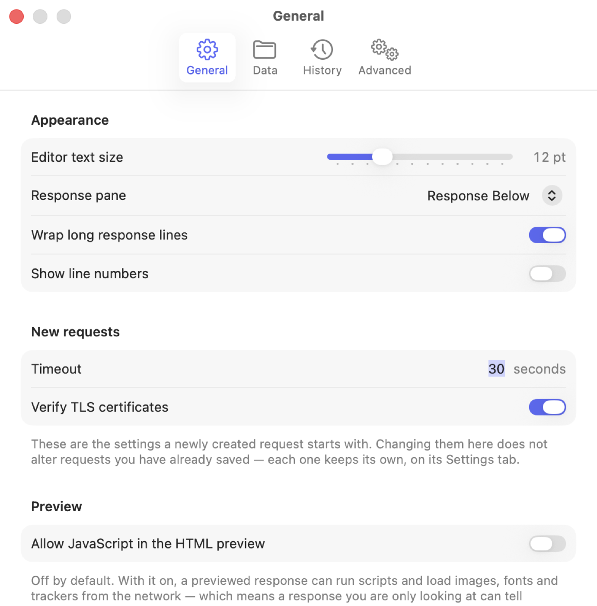

# Postfrau

An HTTP client for macOS 26. A Postman replacement that is a Mac app: your collections are JSON
files in a folder you choose, nothing is uploaded anywhere, and there is no account to make.


## What it does

**Compose and send.** Method, URL, query parameters mirrored two ways with the URL, headers with
completion and a list of what Postfrau will add itself, every auth scheme worth having, and every
body mode — raw with JSON beautify, form, multipart with real file streaming, binary. `{{variables}}`
are coloured and explained where you type them.

**Read the response.** Pretty, raw, a sandboxed HTML preview, headers, cookies. JSON and XML are
pretty-printed and highlighted off the main thread; images and PDFs render inline; anything binary
gets a hex dump. A 20 MB response opens without the window stopping.

**Organise.** Collections and folders with drag-and-drop, variables and auth that inherit down the
tree, ⌘K quick open, a filter that keeps ancestors visible, undo for every structural edit.

**Environments and secrets.** Variables resolve environment → folder → collection → globals, with a
quick-look showing where each value came from and what is shadowing what. Secrets live in the
Keychain and are blank in the files on disk.



**History.** Every send, one JSON file per entry, grouped by day. Recording is **metadata** by
default; **headers** and **full** are opt-in, per app or per collection. Credentials are replaced
with `•••` before anything is written — including inside a body a server echoes back.

**Sync without a server.** Point the data folder at iCloud Drive, Google Drive, Dropbox or a git
checkout and two Macs share the same collections. A change to something you are not editing is
adopted silently; a change to something with unsaved edits keeps yours and parks theirs in
`conflicts/` behind a banner. Nothing is ever deleted.

**Import and export.** Postman v2.1 collections and environments in both directions, and cURL both
ways — paste a `curl` command into the URL bar and the whole request fills in; ⌘⇧C copies one back
out.



## The command line tool

`postfrau` does everything the app does, from a shell — for scripts, and for agents. It reads the
same data folder, writes the same history, and attributes what it sends.

```bash
postfrau ls 'Acme API' --tree
postfrau run 'Acme API/Users/List users' --as claude --json
postfrau send POST https://api.example.com/users -H 'Content-Type: application/json' -d '{"name":"Ada"}'
postfrau history --agent claude --since 2h
```

Install it from **Settings ▸ Advanced ▸ Install Command Line Tool**, which symlinks the copy inside
the app into a folder you pick. From a checkout, `make install` links it into `~/.local/bin`.

### For agents

`postfrau skill install` writes a `SKILL.md` describing the commands, the `--json` shapes, the exit
codes and three worked workflows. An agent with only a shell and that file can explore an API, keep
what works as a collection, and run it — and everything it does shows up in the app with its name
on it.

```bash
postfrau skill install --to .claude/skills/postfrau
```

## Building

Needs macOS 26, Xcode 26 and [XcodeGen](https://github.com/yonaskolb/XcodeGen). No other
dependencies — no packages, no Node, nothing to install first.

```bash
make gen      # generate the Xcode project
make build    # build the app and the CLI
make run      # build and launch
make test     # the commit gate: Core tests plus app unit tests
make release  # a signed DMG in dist/
```

`make live-test` additionally runs the tests that talk to the real network. `make ui-test` runs the
XCUITests, which need a desktop where the window can come to the front.

Signing uses `$CODESIGN_IDENTITY` when it is set and falls back to ad-hoc, so a release build works
without an Apple Developer account. Notarization runs only when `$NOTARY_PROFILE` is set.

## Where your data lives

| What | Where | Synced |
|------|-------|--------|
| Collections, environments, globals | the data folder you choose | yes, by your sync client |
| Secret values | the login Keychain | only with iCloud Keychain on |
| History, settings, window state | `~/Library/Containers/com.postfrau.Postfrau` | never |

Everything is JSON, one document per file, written atomically. You can read it, diff it, and put it
in git.

## What is not here

No scripting, no test assertions, no mock server, no team sync, no WebSocket or gRPC. `PLAN.md` §9
lists what would come next and why. Postfrau is a request client that respects your files; it is not
trying to be a platform.

## Licence

MIT.
