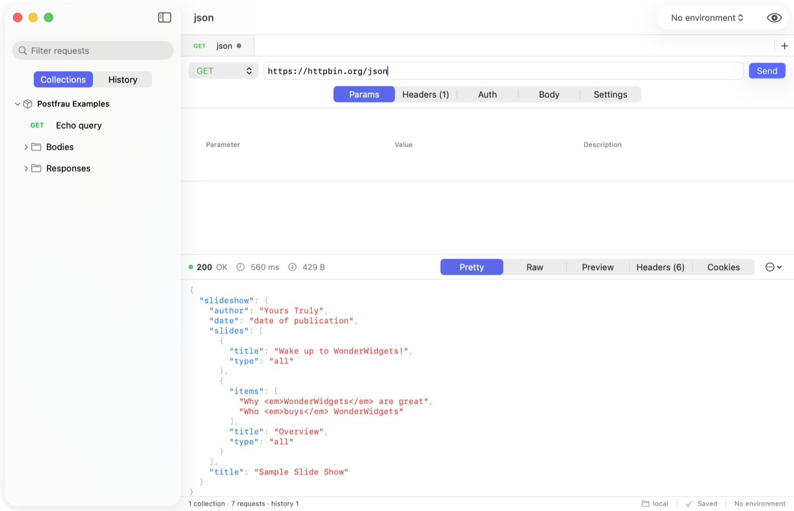

<p align="center">
  
</p>

<h1 align="center">Postfrau</h1>

<p align="center">
  An HTTP client for macOS 26.<br>
  Collections are JSON files in a folder you choose — no account, no cloud, nothing uploaded.
</p>

<p align="center">
  <a href="https://github.com/aliaksei-lithium/postfrau/releases/latest"></a>
  
  
</p>



## Install

Download the DMG from [Releases](https://github.com/aliaksei-lithium/postfrau/releases) and drag
Postfrau to Applications.

The app is ad-hoc signed, so macOS quarantines it. Either **right-click → Open** the first time,
or clear the flag:

```bash
xattr -dr com.apple.quarantine /Applications/Postfrau.app
```

If macOS still refuses with *"Postfrau is damaged"*, that is the quarantine flag — the command
above fixes it.

## Features

- Request editor: params mirrored with the URL, headers, all auth schemes, every body mode
- Response viewer: pretty / raw / preview / headers / cookies, images and PDFs inline, hex for binary
- Collections and folders with inherited variables and auth
- Environments and globals; secrets live in the Keychain, never in the files
- History of every send, redacted by default
- Light, dark or follow-the-system, set per machine — the collections folder stays shared
- Sync by pointing the data folder at iCloud Drive, Dropbox or a git checkout
- Import OpenAPI 3.x; import/export Postman v2.1 and cURL, both directions
- `postfrau` CLI that does all of the above from a shell, including `find` across every request
- A loopback API, so an agent in a sandbox that cannot read your files can still list and send

## Importing an API

```bash
postfrau import openapi.json     # OpenAPI 3.x, or a Postman collection/environment
```

Or **File ▸ Import…**, or drop the file on the sidebar.

An OpenAPI import produces a collection you can send from: `servers[0]` becomes `{{baseUrl}}`,
tags become folders, path templates become `{{variables}}`, security becomes the collection's
auth, and bodies come from the spec's examples — or are synthesised from its schemas. JSON only;
convert YAML first with `yq -o=json spec.yaml > spec.json`.

## CLI

```bash
postfrau ls 'Acme API' --tree
postfrau run 'Acme API/Users/List users' --json
postfrau send POST https://api.example.com/users -H 'Content-Type: application/json' -d '{"name":"Ada"}'
postfrau history --last 20
```

Install it from **Settings ▸ Advanced**, or `make install` from a checkout.

For agents: `postfrau skill install --to .claude/skills/postfrau` writes a `SKILL.md` with the
commands, JSON shapes and exit codes.

## Build

Needs macOS 26, Xcode 26 and [XcodeGen](https://github.com/yonaskolb/XcodeGen). No other dependencies.

```bash
make gen      # generate the Xcode project
make build    # app + CLI
make run
make test     # 495 Core tests + app tests
make release  # signed DMG in dist/
```

Set `CODESIGN_IDENTITY` to sign with a Developer ID, `NOTARY_PROFILE` to notarize. Both optional.

## Where your data lives

| What | Where | Synced |
|---|---|---|
| Collections, environments, globals | the folder you choose | by your sync client |
| Secrets | login Keychain | only with iCloud Keychain on |
| History, settings, window state | app container | never |

## Not Supported

No scripting, test assertions, mock server, team sync, WebSocket or gRPC.

## Licence

MIT
